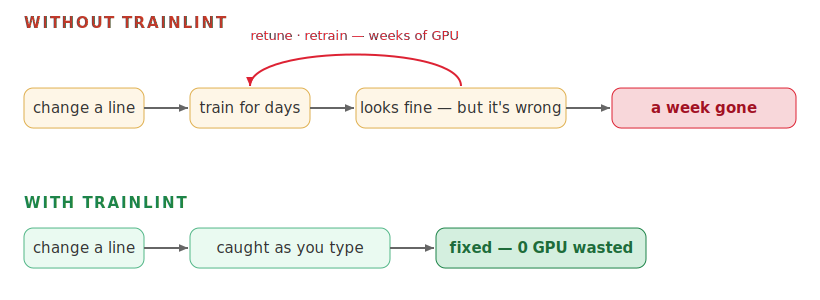

# Trainlint

### It trained fine. That's the bug.

Your AI agent now writes your training code — fast, and just as confident when it's wrong. The worst
training bugs don't crash. The loss still drops, the run looks fine, and a week later you find the
one line that was wrong the whole time.

**Trainlint is the senior researcher looking over your agent's shoulder** — always on, never tired.
It has the three habits an experienced collaborator would:

1. It **catches the silent mistake the moment it's typed.**
2. It **won't let you move on a decision you can't explain.**
3. It **remembers every branch you've already burned.**

The judgment stays yours. It just keeps the work honest.

> You lint your code. Your agent now writes your *training* code. This lints that.

---

## 1. It catches the silent mistake the moment it's typed

Every move the agent makes — change a config, launch a run, touch the model — it sees. And like a
good senior colleague, it reacts in proportion — one of four moves, and the last one covers 99% of
the time:

| | when | who it bothers |
|---|---|---|
| 🚫 **turns it around** | a known-bad setting it's sure about | nobody — the agent just redoes it |
| 🙋 **taps your shoulder** | a change only a human can judge | you — it hands you the diff |
| 👈 **mutters to the agent** | a small "maybe check this" | the agent only |
| 😶 **says nothing** | 99% of the time | nobody |

The skill is in what it *doesn't* send you. It taps your shoulder only for the one case a machine
can't judge and a quiet word can't fix — so you never end up muting it.

**What that looks like.** Say the agent writes this loss, mid-flow:

```python
loss = F.cross_entropy(logits.view(-1, vocab), labels.view(-1))
```

It runs. The loss even drops. But the next-token shift is gone — the model is being asked to predict
each token from *itself*. Only you can say whether that's a bug — an autoregressive model needs the
shift; a diffusion model must *not* have it — so Trainlint hands you the diff:

> *The loss lost its off-by-one shift (`logits[:, :-1]` vs `labels[:, 1:]`). Without it an
> autoregressive model just learns to copy its input — the loss keeps dropping while the output
> collapses to one repeated token. Please confirm.*

Nothing crashed. No test went red. The model would have spent the whole run learning to echo. That's
the week you keep.



**It knows the shapes silent bugs come in.** They feel endless, but they aren't — a few families
cover almost all of them:

1. **Training and inference quietly disagree** — preprocessing that no longer matches the frozen
   encoder, a mask or off-by-one present in training but not generation, padding the tokenizer never
   saw.
2. **The model takes a shortcut you left open** — hand it a crutch (a peek at the answer in
   training) and it leans on that, not the real signal. Great scores with it; collapse without.
3. **You're not measuring the model** — an eval or demo that looks the same whether the model is
   great or broken.
4. **The value you wrote isn't the value that ran** — config piles up from flags, files, env, and
   defaults; the last writer wins, silently.
5. **The ground rots under you** — storage that corrupts under load: fine in a 10-minute test,
   fatal six hours in.

Each is a **principle, not a fact about your project** — it survives a move to a new model or
codebase. Your specifics (which encoder, which path, which number) live in one swappable facts file.
That's ~30 rules today, every one an instance of these five.

**And it makes the agent show its work.** Whenever the agent wires data into a model or touches the
loss, Trainlint makes it trace one batch end to end — from the loader, through each layer, to the
final number — and check it lines up at every step. The trap: two tensors can have the *same shape*
and still mean different things — a label matched up one step off, a weight applied down the wrong
dimension. Nothing errors; the model just trains on the wrong thing. Doing the trace on paper,
before the run, is the cheap way to catch it.

Two things make it safe to leave on:

- **It blocks a move, never your direction.** A "turn it around" stops one action, not your
  approach. A plateau is often right before a breakthrough — it won't prune your search. Information,
  not control; the judgment stays yours.
- **It can never lock you out.** It blocks in only two cases — a mistake it's certain about, or
  high-stakes work on a decision you haven't been quizzed on (more in §2) — always with a polite
  "denied," never by crashing. A bug in the guard is safer than the bug it guards against: it fails
  open by design.

## 2. It won't let you move on a decision you can't explain

A silent bug isn't the only way to lose a week. You can also build the wrong thing — start before
you understand what you're building, or commit to a decision you only half-hold. A good senior
researcher makes you slow down at exactly those moments.

`/trainlint:plan` walks the whole project in plain language — every term defined (no "wait, what's a
DAC?" three weeks in), every claim tied to the actual code — and breaks it into the **decisions**
that quietly determine whether it works. Then it **quizzes you** on each until it sticks.

From then on it stays with you two ways:

- **A compass, every turn** — your **goal**, the **main thread** (the one open question that gates
  everything right now), and the **next action**. Lose the goal and you wander; lose the thread and
  you scatter.
- **A gate on the un-understood** — before high-stakes work (model, loss, training) on a decision
  you've never been quizzed on, it stops and asks *you* to explain it first. Not to gatekeep — the
  silent bugs come from acting on a decision you only half-hold. Answer it (or say "skip") and it
  clears. It runs on the same plan the catch-layer uses: it knows which decision an edit touches, so
  it speaks up on the open ones and stays quiet on the settled.

It holds the agent to the same bar. When the agent signs off with a status report, Trainlint checks
it was written for a teammate who *didn't* build this — a one-line where-we-stand, a real map, plain
words instead of a wall of insider names — and bounces it once for a rewrite if not.

## 3. It remembers every branch you've already burned

The slowest way to lose a week is going in circles — over-tuning a dead branch, re-running what you
already ruled out, hitting a wall a paper would have explained. After enough sessions you don't
remember either. A senior researcher does.

So Trainlint keeps a map. It rebuilds the **search tree** of directions you've tried — from traces
you already leave (run names + a durable log), nothing you maintain by hand. Then it hints, never
prunes:

- when you've over-tuned one branch past the point of return
- when a stuck branch is the *trunk's* fault, not the branch's
- which paper explains the wall you *just* hit — shown when you hit it, not early (reading it early
  is cargo-cult)


**Nothing to maintain.** The tree is rebuilt from traces every run; the one irreplaceable thing —
"why we abandoned X" — is saved to git before a session compacts. See it any time with
`/trainlint:viz`.

## Why a colleague — not a prompt, a skill, or a workflow

Why this form, and not a doc or a command? The mistakes are silent, constant, and you don't know
you're making them.

- A **prompt** (CLAUDE.md) is advice you can ignore — always-on noise, blind to the actual diff,
  unable to stop anything.
- A **skill or workflow** has to be *invoked* — but you'd never call a "check my training code" step
  at the exact second you drop an off-by-one, and running a workflow per edit is heavy and backwards.

Only something **ambient** works: on every action, unasked, seeing the real diff, able to stop the
bad one. That's what a senior colleague is — present, not summoned.

One rule keeps it honest: **route each call to whoever can actually judge it.** Machine-checkable →
turned around silently. Only a human can tell → sent to you. Everything else → a quiet word to the
agent. A small model may help *route* a call, but it never judges whether code is correct — that's
for a deterministic check, or for you.

The scars behind each rule are in [DESIGN.md](trainlint/DESIGN.md) — read it before adding rules.

## Install

```
/plugin marketplace add voidrank/Trainlint
/plugin install trainlint@trainlint
```

Pure Python standard library — **zero dependencies.** Then it just runs. See
[INSTALL.md](INSTALL.md) for a single-machine (no-plugin) setup.

## Use it on your project

```
/trainlint:init <name>      # register a project (thin — no TODO ceremony)
/trainlint:plan             # understand it end-to-end, break it into decisions, get quizzed
/trainlint:quiz             # drill the decisions + the concepts you keep forgetting
/trainlint:viz              # see your search tree
/trainlint:lint             # directionality + "read this now" hints
```

## Why it stays general

The **mechanism is fixed**, the **principles are portable**, the **project facts are one swappable
file.** Porting to a new project = write one `project.<name>.json`; the rules don't change. Read
[DESIGN.md](trainlint/DESIGN.md) before adding rules — it keeps the principles from drifting as the
list grows.
